

  <aside class="col">
    
<strong>Disclaimer</strong>. At the moment Sticker Store LLC does not offer any vinyl application service. We strongly recommend referring to a local tint or wrap shop for professional application of the sun strips and banners on your vehicle. If you have some tinting or wrapping experience or feel comfortable applying the sun strip yourself please follow the instructions below. However, returns and replacement negotiations upon the application issues (bubbles, ripples etc.) are not carried out on our end.

  </aside>

<!-- <h3 class="h2 mt-4">Need a Sun Strip or Windshield Banner for Your Car?</h3>-->

  
 Check our online tool and create your <strong>custom windshield banner or sun strip</strong> with personalized wording, fonts and colors.

  

    <a href="/custom-windshield-banner-sun-strip" class="btn btn-primary btn-blueberry btn-lg">Design Your Windshield Banner Now →</a>
  

<!-- <h3 class="h2 mt-4">What Product do You Have?</h3> -->

Are You Applying a Windshield Sun Strip or a Banner?

Please click corresponding icon below.

  

    <nav class="nav nav-pills nav-justified mt-4 mb-3">
      <button class="btn nav-link active px-4 py-4" id="sun-strip" data-toggle="tab" data-target="#sun-strip-tab" role="tab" aria-controls="sun-strip-tab" aria-selected="true" >
        
          <svg data-name="sun-strip" xmlns="http://www.w3.org/2000/svg" viewBox="0 0 612 305.21" width="85" height="42"><defs></defs><title>icon-sun-strip</title><path class="cls-1" d="M539,0H73L0,268.32l7.67,2C9,270.63,146,305.21,306,305.21s297-34.58,298.33-34.93l7.67-2ZM430.49,22.41a1.81,1.81,0,0,1,1.87-1.87h25.09a3.2,3.2,0,0,1,2.35,1l5.18,5.1A3.54,3.54,0,0,1,466,29V53.41a3.58,3.58,0,0,1-1,2.35l-5.18,5.1a3.23,3.23,0,0,1-2.35,1H443.2a.79.79,0,0,0-.64.28,1,1,0,0,0-.25.69V77.69a1.77,1.77,0,0,1-.56,1.34,1.86,1.86,0,0,1-1.3.53h-8.09a1.81,1.81,0,0,1-1.87-1.87Zm-18.29,0a1.82,1.82,0,0,1,.53-1.34,1.8,1.8,0,0,1,1.33-.53h8.1a1.84,1.84,0,0,1,1.29.53,1.75,1.75,0,0,1,.57,1.34V77.69a1.75,1.75,0,0,1-.57,1.34,1.84,1.84,0,0,1-1.29.53h-8.1a1.8,1.8,0,0,1-1.33-.53,1.82,1.82,0,0,1-.53-1.34Zm-42.25,0a1.8,1.8,0,0,1,1.86-1.87H396.9a3.2,3.2,0,0,1,2.35,1l5.18,5.1a3.54,3.54,0,0,1,1,2.34V48.63a3.19,3.19,0,0,1-1,2.35l-5,5a.64.64,0,0,0-.16.73l7.93,20.88a1.45,1.45,0,0,1,.09.57,1.32,1.32,0,0,1-.41,1,1.34,1.34,0,0,1-1,.41h-8.42a1.52,1.52,0,0,1-1.54-1.06L388.08,58a1.41,1.41,0,0,0-1.38-.89h-4a.94.94,0,0,0-.69.29.91.91,0,0,0-.28.68V77.69A1.75,1.75,0,0,1,381.2,79a1.86,1.86,0,0,1-1.3.53h-8.09A1.8,1.8,0,0,1,370,77.69Zm-39.59,0a1.81,1.81,0,0,1,1.87-1.87h29.3a1.81,1.81,0,0,1,1.86,1.87v6.88a1.76,1.76,0,0,1-.53,1.33,1.8,1.8,0,0,1-1.33.53h-7.77a1,1,0,0,0-1,1V77.69a1.81,1.81,0,0,1-1.87,1.87h-8a2,2,0,0,1-1.38-.53,1.77,1.77,0,0,1-.56-1.34V32.12a1,1,0,0,0-.24-.69.82.82,0,0,0-.65-.28h-7.85a1.82,1.82,0,0,1-1.34-.53,1.8,1.8,0,0,1-.53-1.33Zm-40.71,37.8a1.3,1.3,0,0,1,.57-1.13,1.53,1.53,0,0,1,1.29-.25l8.74,2.67a1.27,1.27,0,0,1,.89.53,1.67,1.67,0,0,1,.33,1v3.64a1.06,1.06,0,0,0,.32.81l1,1.06a1.24,1.24,0,0,0,.89.4h6.07a.86.86,0,0,0,.81-.4l1.14-1.06a1.1,1.1,0,0,0,.32-.81V60.53a1.28,1.28,0,0,0-.65-1.13L291.19,46.61a3.26,3.26,0,0,1-1.54-2.83V29a3.17,3.17,0,0,1,1-2.34l5.1-5.1a3.2,3.2,0,0,1,2.35-1h17.32a3,3,0,0,1,2.35,1l5.18,5.1a3.17,3.17,0,0,1,1,2.34V39.89a1.29,1.29,0,0,1-.57,1.13,1.54,1.54,0,0,1-1.29.25l-8.74-2.67a1.64,1.64,0,0,1-.9-.61,1.73,1.73,0,0,1-.32-1V33.42a1,1,0,0,0-.32-.81l-1.14-1.14a1.1,1.1,0,0,0-.81-.32h-6.07a1.7,1.7,0,0,0-.89.32l-1,1.14a.93.93,0,0,0-.32.81v4.93a1.47,1.47,0,0,0,.64,1.22l20.24,12.71a3.25,3.25,0,0,1,1.54,2.83v16a2.92,2.92,0,0,1-1,2.26l-5.1,5.18a3.2,3.2,0,0,1-2.35,1H298.15a2.88,2.88,0,0,1-2.35-1l-5.18-5.18a2.92,2.92,0,0,1-1-2.26ZM228.7,22.41a1.8,1.8,0,0,1,1.86-1.87h9.63a1.67,1.67,0,0,1,.93.29,1.41,1.41,0,0,1,.61.77l11.33,28.33a.2.2,0,0,0,.25.12.19.19,0,0,0,.16-.2V22.41a1.77,1.77,0,0,1,.56-1.34,2,2,0,0,1,1.38-.53h8a1.81,1.81,0,0,1,1.87,1.87V77.69a1.81,1.81,0,0,1-1.87,1.87h-9.63a1.73,1.73,0,0,1-1.54-1.06L240.92,50.17a.19.19,0,0,0-.24-.12.19.19,0,0,0-.16.2V77.69a1.81,1.81,0,0,1-1.87,1.87h-8.09a1.8,1.8,0,0,1-1.86-1.87Zm-41.93,0a1.8,1.8,0,0,1,1.86-1.87h8a2,2,0,0,1,1.38.53,1.75,1.75,0,0,1,.57,1.34V66.68a1.06,1.06,0,0,0,.32.81L200,68.63a1.7,1.7,0,0,0,.89.32h7.29a1.66,1.66,0,0,0,.81-.32L210,67.49a1.14,1.14,0,0,0,.4-.81V22.41a1.81,1.81,0,0,1,1.87-1.87h8a1.81,1.81,0,0,1,1.86,1.87V71.14a3.08,3.08,0,0,1-.89,2.26l-5.18,5.18a3.2,3.2,0,0,1-2.35,1H195.19a3.2,3.2,0,0,1-2.35-1l-5.1-5.18a2.92,2.92,0,0,1-1-2.26Zm-40.72,37.8a1.3,1.3,0,0,1,.57-1.13,1.53,1.53,0,0,1,1.29-.25l8.75,2.67a1.32,1.32,0,0,1,.89.53,1.73,1.73,0,0,1,.32,1v3.64a1.1,1.1,0,0,0,.32.81l1.06,1.06a1.22,1.22,0,0,0,.89.4h6.07a.88.88,0,0,0,.81-.4l1.13-1.06a1.1,1.1,0,0,0,.32-.81V60.53a1.27,1.27,0,0,0-.64-1.13L147.59,46.61a3.26,3.26,0,0,1-1.54-2.83V29a3.17,3.17,0,0,1,1-2.34l5.1-5.1a3.2,3.2,0,0,1,2.35-1h17.32a3,3,0,0,1,2.35,1l5.18,5.1a3.17,3.17,0,0,1,1,2.34V39.89a1.29,1.29,0,0,1-.57,1.13,1.53,1.53,0,0,1-1.29.25l-8.74-2.67a1.58,1.58,0,0,1-.89-.61,1.67,1.67,0,0,1-.33-1V33.42a1,1,0,0,0-.32-.81L167,31.47a1.13,1.13,0,0,0-.81-.32h-6.07a1.64,1.64,0,0,0-.89.32l-1.06,1.14a1,1,0,0,0-.32.81v4.93a1.46,1.46,0,0,0,.65,1.22l20.23,12.71a3.25,3.25,0,0,1,1.54,2.83v16a2.92,2.92,0,0,1-1,2.26l-5.1,5.18a3.2,3.2,0,0,1-2.35,1H154.55a2.88,2.88,0,0,1-2.35-1L147,73.4a2.92,2.92,0,0,1-1-2.26ZM491.48,275.63,451.88,255H501.3V239.37H333.35V255h84.78l46.54,24.27A1286.68,1286.68,0,0,1,306,289.6q-6.84,0-13.61-.08l.76-1.45L229.38,255h49.27V239.37H110.7V255h84.79l65,33.71C143.64,284.08,46.61,263.35,19.25,257L62.07,99.64H549.93L592.75,257C577.58,260.53,541,268.47,491.48,275.63Z"/><path class="cls-1" d="M443.2,51.22h8.66a1.51,1.51,0,0,0,.81-.32l1.06-1.13a.87.87,0,0,0,.4-.81V33.42a.86.86,0,0,0-.4-.81l-1.06-1.14a1.59,1.59,0,0,0-.81-.32H443.2a.79.79,0,0,0-.64.28,1,1,0,0,0-.25.69V50.25a1,1,0,0,0,.25.69A.79.79,0,0,0,443.2,51.22Z"/><path class="cls-1" d="M382.74,46.53h8.58a1.17,1.17,0,0,0,.81-.41l1.05-1a1.16,1.16,0,0,0,.4-.81V33.42a.86.86,0,0,0-.4-.81l-1.05-1.14a1.66,1.66,0,0,0-.81-.32h-8.58a1,1,0,0,0-1,1V45.56a.9.9,0,0,0,.28.68A.91.91,0,0,0,382.74,46.53Z"/></svg>
        
      </button>
      <button class="btn nav-link px-4 py-4" id="banner" data-toggle="tab" data-target="#banner-tab" role="tab" aria-controls="banner-tab" aria-selected="false">
        
          <svg data-name="banner" xmlns="http://www.w3.org/2000/svg" viewBox="0 0 612 305.21" width="85" height="42"><defs></defs><title>icon-banner</title><path class="cls-1" d="M193.93,152.44a4,4,0,0,0-2.89-1.19H160.17a2.19,2.19,0,0,0-2.29,2.29v68a2.21,2.21,0,0,0,2.29,2.29H191a3.93,3.93,0,0,0,2.89-1.2l6.27-6.27a4,4,0,0,0,1.29-2.89V192.87A4.4,4.4,0,0,0,200.3,190L198,187.79c-.14-.2-.14-.36,0-.5l2.29-2.19a4.36,4.36,0,0,0,1.19-2.88V161.6a4,4,0,0,0-1.29-2.88ZM187,208a1.42,1.42,0,0,1-.49,1l-1.3,1.4a2,2,0,0,1-1,.39H173.51a1,1,0,0,1-.79-.34,1.26,1.26,0,0,1-.3-.85V195.26a1.24,1.24,0,0,1,.3-.84,1,1,0,0,1,.79-.35h10.66a2,2,0,0,1,1,.39l1.3,1.4a1.06,1.06,0,0,1,.49,1Zm0-29.78a1.42,1.42,0,0,1-.49,1l-1.3,1.39a1.91,1.91,0,0,1-1,.4H173.51a1,1,0,0,1-.79-.35,1.24,1.24,0,0,1-.3-.84V165.49a1.26,1.26,0,0,1,.3-.85,1,1,0,0,1,.79-.35h10.66a2,2,0,0,1,1,.4l1.3,1.39a1.08,1.08,0,0,1,.49,1Z"/><path class="cls-1" d="M239.83,151.84a2.56,2.56,0,0,0-1.69-.59H222.3a2.62,2.62,0,0,0-1.64.59,2.57,2.57,0,0,0-.94,1.5l-14.24,68.41a1.53,1.53,0,0,0,.34,1.44,1.79,1.79,0,0,0,1.45.65h10.35a1.92,1.92,0,0,0,1.25-.45,2.33,2.33,0,0,0,.75-1.24l2.78-14.34a1.65,1.65,0,0,1,1.7-1.4h12.25a1.68,1.68,0,0,1,1.14.4,2.35,2.35,0,0,1,.65,1l2.69,14.34a2.26,2.26,0,0,0,.74,1.24,1.92,1.92,0,0,0,1.25.45h10.35a1.71,1.71,0,0,0,1.8-1.79v-.3l-14.24-68.41A2.77,2.77,0,0,0,239.83,151.84Zm-5.28,41.23a1,1,0,0,1-.69.3h-7.27a.86.86,0,0,1-.9-.9v-.2L230,171.66c0-.2.08-.3.25-.3s.28.1.35.3l4.18,20.61A.82.82,0,0,1,234.55,193.07Z"/><path class="cls-1" d="M301.67,151.25h-9.86a2.39,2.39,0,0,0-1.69.64,2.16,2.16,0,0,0-.7,1.65v33.75a.26.26,0,0,1-.5.1L275,152.54a1.7,1.7,0,0,0-.75-.94,2,2,0,0,0-1.14-.35H261.24a2.21,2.21,0,0,0-2.29,2.29v68a2.22,2.22,0,0,0,2.29,2.29h10a2.19,2.19,0,0,0,1.64-.65,2.23,2.23,0,0,0,.65-1.64V187.79a.26.26,0,0,1,.49-.1l13.95,34.86a2.1,2.1,0,0,0,1.89,1.29h11.85a2.19,2.19,0,0,0,1.64-.65,2.23,2.23,0,0,0,.65-1.64v-68a2.27,2.27,0,0,0-.65-1.65A2.22,2.22,0,0,0,301.67,151.25Z"/><path class="cls-1" d="M354.74,151.25h-9.86a2.41,2.41,0,0,0-1.69.64,2.2,2.2,0,0,0-.7,1.65v33.75a.23.23,0,0,1-.19.25.23.23,0,0,1-.3-.15l-13.95-34.85a1.72,1.72,0,0,0-.74-.94,2.06,2.06,0,0,0-1.15-.35H314.31a2.22,2.22,0,0,0-1.64.64,2.27,2.27,0,0,0-.65,1.65v68a2.23,2.23,0,0,0,.65,1.64,2.19,2.19,0,0,0,1.64.65h10a2.19,2.19,0,0,0,1.64-.65,2.23,2.23,0,0,0,.65-1.64V187.79a.25.25,0,0,1,.2-.25.25.25,0,0,1,.3.15L341,222.55a2.11,2.11,0,0,0,1.89,1.29h11.85a2.21,2.21,0,0,0,2.29-2.29v-68a2.19,2.19,0,0,0-2.29-2.29Z"/><path class="cls-1" d="M399.75,151.25H367.39a2.3,2.3,0,0,0-1.6.64,2.19,2.19,0,0,0-.69,1.65v68a2.15,2.15,0,0,0,.69,1.64,2.26,2.26,0,0,0,1.6.65h32.36a2.36,2.36,0,0,0,1.69-.65,2.13,2.13,0,0,0,.7-1.64v-8.46a2.15,2.15,0,0,0-.7-1.65,2.4,2.4,0,0,0-1.69-.65H380.83a1.18,1.18,0,0,1-.85-.34,1.16,1.16,0,0,1-.34-.85V195.26a1.18,1.18,0,0,1,1.19-1.19h12.45a2.22,2.22,0,0,0,2.29-2.29v-8.47a2.22,2.22,0,0,0-2.29-2.29H380.83a1.18,1.18,0,0,1-1.19-1.19V165.49a1.16,1.16,0,0,1,.34-.85,1.19,1.19,0,0,1,.85-.35h18.92a2.39,2.39,0,0,0,1.69-.64,2.15,2.15,0,0,0,.7-1.65v-8.46a2.16,2.16,0,0,0-.7-1.65A2.39,2.39,0,0,0,399.75,151.25Z"/><path class="cls-1" d="M446.15,195.76a.79.79,0,0,1,.2-.9l6.18-6.17a4,4,0,0,0,1.19-2.89V161.6a4.43,4.43,0,0,0-1.19-2.88l-6.38-6.28a3.94,3.94,0,0,0-2.88-1.19H412.4a2.23,2.23,0,0,0-1.65.64,2.26,2.26,0,0,0-.64,1.65v68a2.22,2.22,0,0,0,.64,1.64,2.2,2.2,0,0,0,1.65.65h10a2.26,2.26,0,0,0,1.6-.65,2.15,2.15,0,0,0,.69-1.64v-24.1a1.18,1.18,0,0,1,1.2-1.19h4.88a1.72,1.72,0,0,1,1.69,1.09l9.66,25.2a1.86,1.86,0,0,0,1.89,1.29h10.36a1.71,1.71,0,0,0,1.69-1.69,1.66,1.66,0,0,0-.1-.7Zm-7-15.34a1.42,1.42,0,0,1-.49,1l-1.3,1.29a1.4,1.4,0,0,1-1,.5H425.84a1.2,1.2,0,0,1-1.2-1.19V165.49a1.17,1.17,0,0,1,.35-.85,1.19,1.19,0,0,1,.85-.35h10.55a2,2,0,0,1,1,.4l1.3,1.39a1.08,1.08,0,0,1,.49,1Z"/><path class="cls-1" d="M539,0H73L0,268.32l7.67,2C9,270.63,146,305.21,306,305.21s297-34.58,298.33-34.92l7.67-2ZM380.5,15.61,364,32.07H249L232.5,15.61ZM489.65,275.89,451.88,256.2H501.3V240.59h-168V256.2h84.79l44.65,23.28A1284.07,1284.07,0,0,1,306,289.6q-6.51,0-13-.07l.13-.25L229.38,256.2h49.27V240.59h-168V256.2h84.8l62.42,32.38C142.23,283.78,46.41,263.31,19.25,257L84.93,15.61h125.5L242.5,47.68h128l32.08-32.07h124.5L592.75,257C577.39,260.57,540.08,268.66,489.65,275.89Z"/></svg>
        
      </button>
    </nav>
    
Sun strip is applied on the outside top part of the windshield. Banner can be applied on the outside top, bottom as well as the side of the windshield

  

<section class="tab-pane fade show active" id="sun-strip-tab" role="tabpanel" aria-labelledby="sun-strip">

  <!-- Sun Strip Tab : Begin -->
  <h2 class="d-none">How to Install Windshield Sun Strip on a Car or Truck?</h2>
  <h3 class="h2 mt-4">Required Tools</h3>
  
You will need to have a following set of <strong>basic tools</strong> to apply a sun strip on your car:

  <ul class="list-unstyled row justify-content-center my-2">
    <li class="col-6 col-md-4 my-2 text-center"> Tape measuer or ruler</li>
    <li class="col-6 col-md-4 my-2 text-center"> Masking tape</li>
    <li class="col-6 col-md-4 my-2 text-center"> Window cleaner or rubbing alcohol</li>
    <li class="col-6 col-md-4 my-2 text-center"> Spray bottle for soapy water</li>
    <li class="col-6 col-md-4 my-2 text-center"> Bondo spreader</li>
    <li class="col-6 col-md-4 my-2 text-center"> Knife or blade</li>
    <li class="col-6 col-md-4 my-2 text-center"> Paper towel roll</li>
  </ul>

  <h3 class="h2 mt-4">Before you Start</h3>
  
Please take your time to check if the sun strip has any defects such as rips or cuts. If there is any damage we will offer you a free replacement! We cannot guarantee this service once the backing fo transfer tape were removed off the product.

  <h3 class="h2 mt-4">Clean your Windshield</h3>
  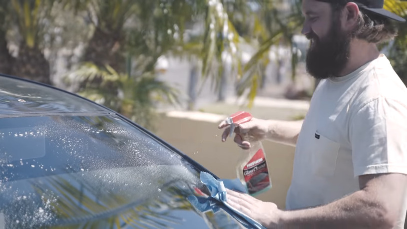
  
Remove any loose dirt, bugs and other possible contamination from the windshield. Next, degrease the windshield with some cleaner. Rubbing alcohol or Windex will work great.

  <h3 class="h2 mt-4">Align the Sun Strip</h3>
  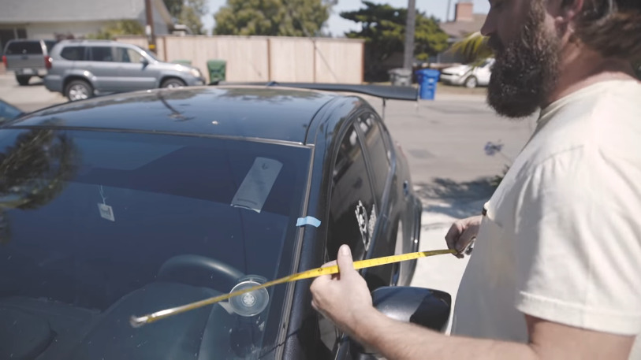
  
Unpack the sun strip and set it over the windshield. Use ruler or other measuring tool to ensure the sun strip is centered on top of windshield. Sun strip should cover all the rubber weather strips of the top part of the windshield. Use masking tape to mark desired position of the sun strip on your vehicle.

  <h3 class="h2 mt-4">Expose the Adhesive Side</h3>
  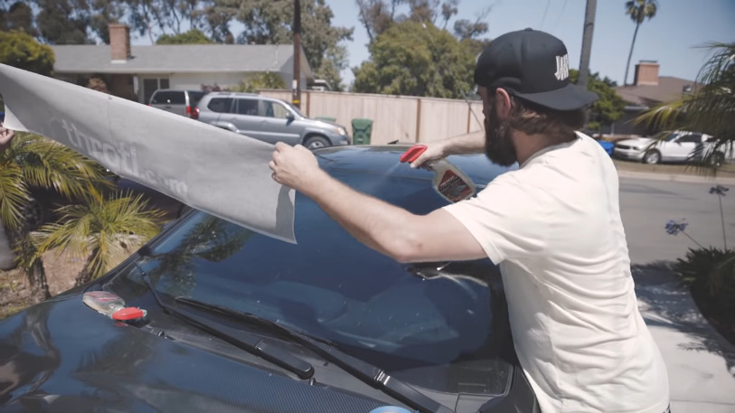
  
Separate the backing of the sun strip to expose the adhesive vinyl side. Mix <strong>1 drop of dish soap per 32 oz of water</strong> in a spray bottle. Spray over the adhesive side of the sun strip, roof and windshield. Additionally wet the opposite (outside) surface of the sun strip with transfer paper overlay. This will help work out the creases.

  <h3 class="h2 mt-4">Set Flat over the Wet Windshield</h3>
  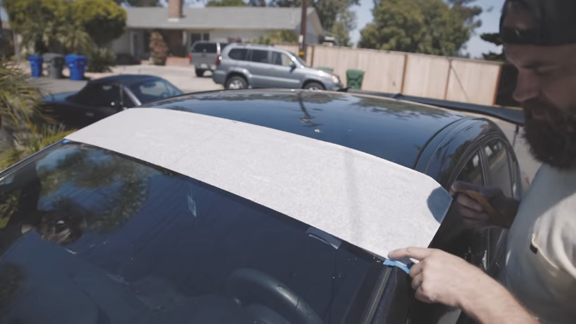
  
Position the sun strip on the windshield and align with respect to the tape marks made earlier. It is much easier to have two people here. One on each side of the vehicle. While the sun strip adhesive side is wet, you can re-position it multiple times on the windshield. Ensure the sun strip sits flat with no folds. With a spreader or credit card, squeeze water and air bubbles from in between of the windshield and the sun strip. Go from the center of the sun strip towards its sides.

  <h3 class="h2 mt-4">Dry with Paper Towels and Remove Transfer</h3>
  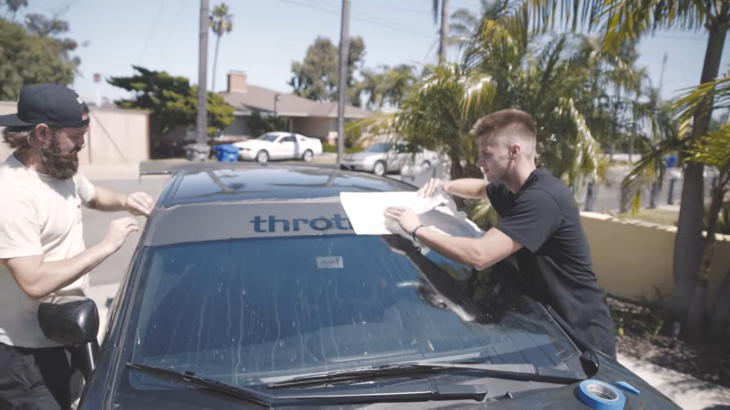
  
Use a paper towel roll to absorb all the moisture on top and around the sun strip. Give it about 10 minutes to dry. Next, remove the transfer paper from the face of the sun strip. Peel back against the glass, avoid pulling the transfer tape up (see picture above).

  <h3 class="h2 mt-4">Cut Sun Strip along the Windshield Seal</h3>
  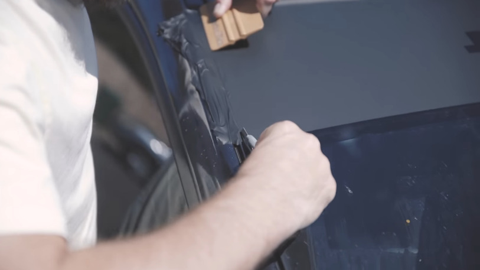
  
Use the spreader and knife to work on the edges of the sun strip. squeeze any leftover moisture from under the edges and use knife to trim the sun strip along the windshield edge (or rubber weather seal). Please allow 24 hours for the banner to dry. Otherwise it can get torn at higher speeds on a highway.

  <h3 class="h2 mt-4">Installation Video</h3>
  
We find the video below best describing the installation process. Feel free to check it out and hit the 👍 button.

  

  
<small>Images and video on this page are intellectual property of the <a href="https://www.youtube.com/@throtl">@throtl YouTube channel</a>.</small>

  <!-- Sun Strip Tab : End -->

</section>
<section class="tab-pane fade" id="banner-tab" role="tabpanel" aria-labelledby="banner">

  <!-- Banner Tab : Begin -->
  <h2 class="d-none">How to apply a Windshield Banner on a Vehicle?</h2>
  <h3 class="h2 mt-4">Required Tools</h3>
  
You will need to have a following set of <strong>basic tools</strong> to apply a banner on your car:

  <ul class="list-unstyled row justify-content-center my-2">
    <li class="col-6 col-md-4 my-2 text-center"> Tape measuer (ruler)</li>
    <li class="col-6 col-md-4 my-2 text-center"> Masking tape</li>
    <li class="col-6 col-md-4 my-2 text-center"> Bondo spreader</li>
  </ul>

  <h3 class="h2 mt-4">Clean the Windshield</h3>
  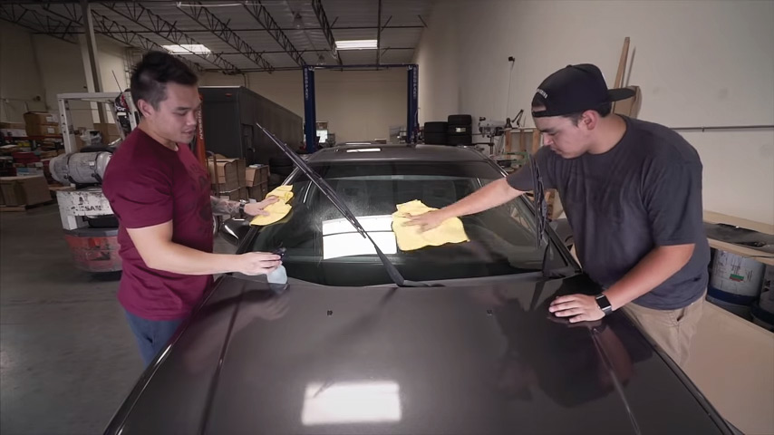
  
Remove any loose dirt, bugs and other possible contamination from the windshield. Next, use rubbing alcohol and a microfiber towel to clean the surface of the windshield. This will provide a good adhesion between the decal and window.

  <h3 class="h2 mt-4">Align the Decal</h3>
  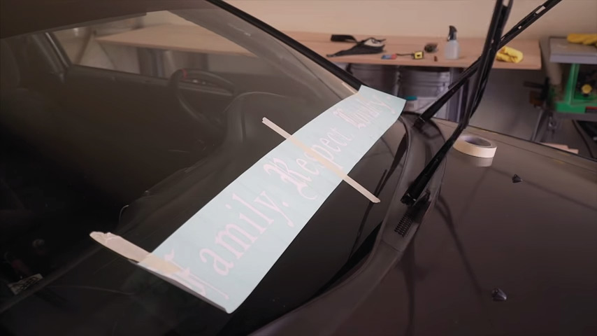
  
Place the decal on top of the windshield. Use a ruler to ensure the banner is centered with respect to the windshield. Fix the banner in place with the masking tape. Put a long line of the tape across the center and fix the edges.

  <h3 class="h2 mt-4">Remove Backing on One Side</h3>
  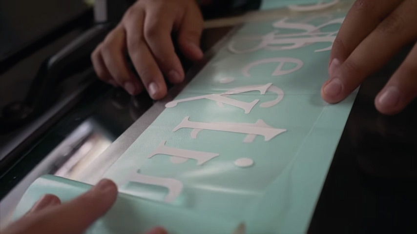
  
Peel off the backing on one side of the banner all the way to the center. When peeling make sure all the vinyl lettering resided on the transparent transfer tape. When done, cut the part of the backing that was peeled off.

  <h3 class="h2 mt-4">Remove Backing on One Side</h3>
  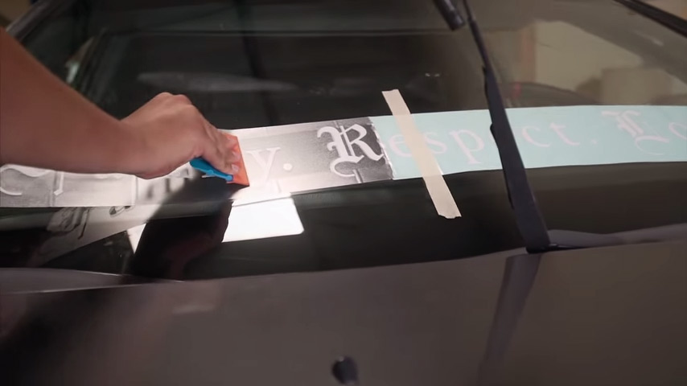
  
Hold the transfer tape with the vinyl above the windshield. Firmly pressing on a squeegee or a credit card go from the center towards the edge of the banner. One side of the banner is now applied.

  <h3 class="h2 mt-4">Work on the Other Side</h3>
  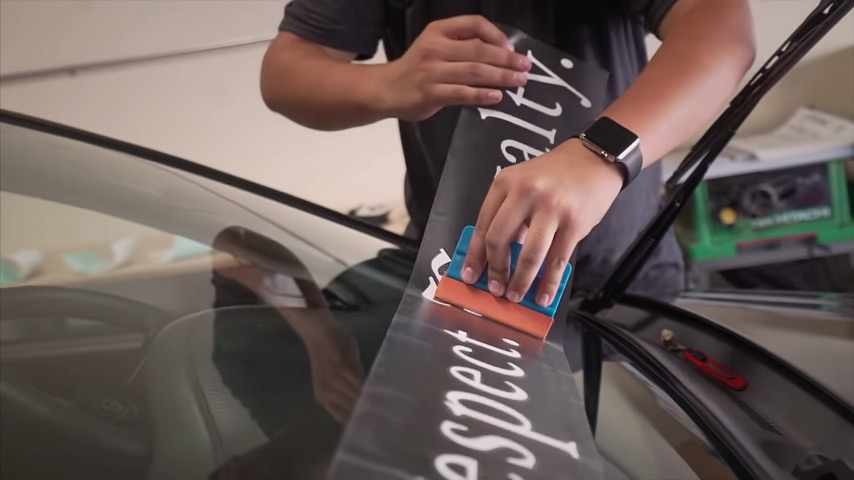
  
Repeat the same procedure with the other side of the banner. Remove the masking tape. Peel off the backing. Holding the transfer tape above the windshield drag the spreader from the center towards the edge of the banner.

  <h3 class="h2 mt-4">Work on the Other Side</h3>
  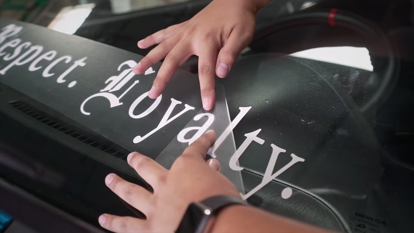
  
Repeat the same procedure with the other side of the banner. Remove the masking tape. Peel off the backing. Holding the transfer tape above the windshield drag the spreader from the center towards the edge of the banner.

  <h3 class="h2 mt-4">Installation Video</h3>
  
We find the video below below best describing the installation process. Feel free to check it out and hit the 👍 button.

  

  
<small>Images and video on this page are intellectual property of the <a href="https://www.youtube.com/@SmurfinWRX">@SmurfinWRX YouTube channel</a>.</small>

  <!-- Banner Tab : End -->

</section>

