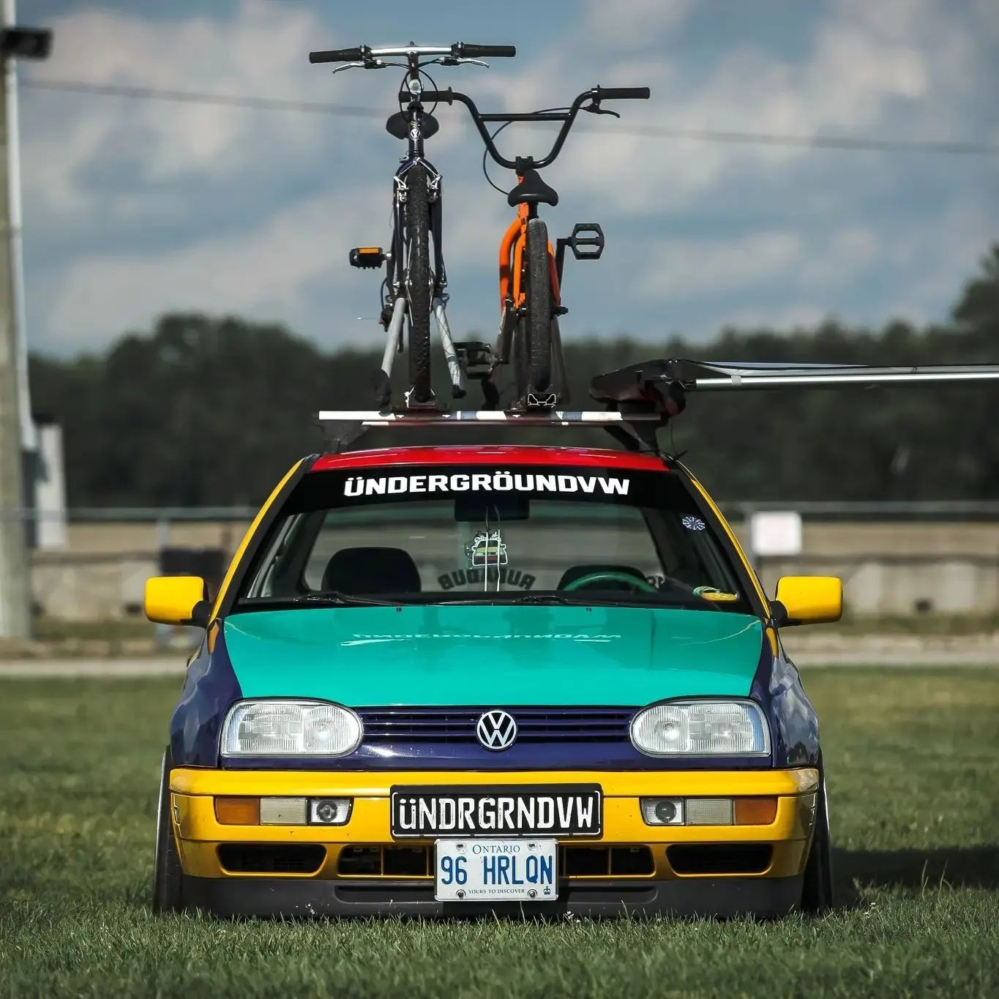

## But what exactly are windshield banners and sun strips, and how do they work?

A windshield banner is a strip of vinyl or other material that is applied to the top of your windshield. It typically features a message or design that runs the length of the windshield, making it visible from both the inside and outside of your vehicle. Windshield banners are commonly used to promote a business or organization, advertise a special event, or show support for a sports team.

A sun strip, on the other hand, is a shorter strip of vinyl or other material that is applied to the top of your windshield, just above the driver's line of sight. Sun strips are designed to reduce the amount of sunlight that enters the car, helping to reduce glare and make driving safer and more comfortable.

Both windshield banners and sun strips are easy to install and can be removed without damaging your windshield or leaving any residue behind. They're also weather-resistant and can withstand the elements, making them a durable and long-lasting addition to your vehicle.

  

    
    <blockquote>Our <a href="https://www.instagram.com/the_hoodlums.no/" rel="nofollow">customer's BMW</a> with personalized sun strips.</blockquote>
  

  

    
    <blockquote>Windshield sun strips are universal and will fit any car make and model. For instance, <a href="https://www.instagram.com/thatginstergti/" rel="nofollow">check this VW with our Windshield Banner</a>.</blockquote>
  

So if you're looking to add a little personality and style to your ride, or if you're looking for a creative way to promote your business or organization, a custom windshield banner or sun strip is the perfect solution. At our company, we can help you create a design that will make your vehicle stand out from the crowd and get noticed.

To order your custom windshield banner or sun strip today, visit our website and browse our selection of colors, fonts, and designs. We offer fast and affordable shipping, so you can start enjoying your new accessory in no time.

  
At Sticker Store LLC, we specialize in creating <strong>custom windshield banners and sun strips</strong> to meet your specific needs. With a variety of colors, fonts, and designs to choose from, you can create a one-of-a-kind banner that reflects your personality and style.

  

    <a href="/custom-windshield-banner-sun-strip" class="btn btn-primary btn-blueberry btn-lg">Create Your Personalized Sun Strip Now!</a>
  

## Why do people love windshield banners?

People love windshield banners for a variety of reasons. Here are some of the most common reasons why people choose to add a custom windshield banner to their car or truck:

1. **Personalization** - A custom windshield banner allows you to add a personalized touch to your vehicle, making it stand out from the crowd and reflecting your individual style and personality.

2. **Advertising** - For businesses and organizations, a windshield banner is a great way to promote your brand and increase visibility. With a custom design, you can create a memorable message that will help people remember your business and what you offer.

3. **Team spirit** - Many sports fans love to show support for their favorite teams by adding a custom windshield banner that features the team's logo or colors. It's a great way to show your team spirit and connect with other fans.

4. **Sun protection** - A sun strip is a practical addition to your vehicle that can help reduce glare and protect your eyes from the sun's harmful rays. It can make driving safer and more comfortable, especially during long trips or in areas with intense sunlight.

<blockquote>How Windshield Banners and Sun Strips look inside the car? It creates a very comfortable feeling inside the cabin!</blockquote>

Overall, windshield banners are a fun and practical way to add a personal touch to your vehicle while also promoting your business or team spirit. They're easy to install, affordable, and can make a big impact on the look and feel of your car or truck.